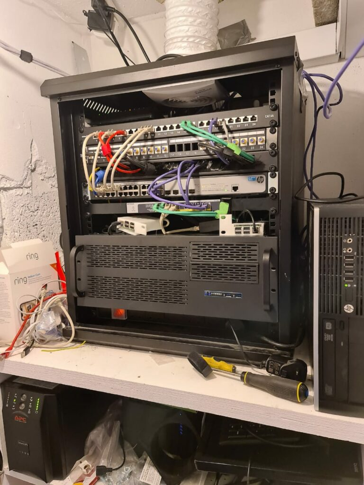

When I was young I was always wanting to tinker with stuff. I remember excitedly downloading an Ubuntu ISO, burning it to a CD, and installing it on an old Pentium PC that I had got from somewhere.

This was back in the early 2000s. It probably wasn't even really used as a server per se but using Linux for me then meant it was serious. In reality, it was used more as a test bed for me to learn Linux and specifically PHP and SQL.

It probably never even exposed anything to the internet, so was more of a development machine than a server. Despite that, I distinctly remember that machine, Azaroth as it was fondly known, as it was probably the machine that got me further than just an interest in computer games and turned me more onto the development path,

A few years later Azaroth got an upgrade and moved to my friend Josh's house, as he had broadband (24x7-on internet was a big thing back then). This server did a little more, hosted a few websites, provided SSH access for a few friends, and hosted an IRC server (This is sounding more and more dated the further I get).

It was around this time that I got my first job in the IT field, it was around this time that I fell out of love with maintaining stuff at home and my home setup got cut right back. It consisted of a 4 bay NAS and a few Raspberry Pis for assorted tasks.

This all changed when we moved into the new house. We had to do a large amount of wiring to change the heating over in the house, and therefore I had all the walls and ceilings open. This was the perfect excuse for a load of CAT6 runs. All the drops went back to a single place in the utility cupboard. What started off as a small networking rack slowly escalated, and the search began for hardware to populate it.

Below is the most recent photo I have of the rack (although this is by no means up to date). It is considerably tidier than this now and the Raspberry Pis are now gone with it all virtualized on the below.

Details on the setup will be in the next post, which I'm sure nobody is waiting for with bated breath.

