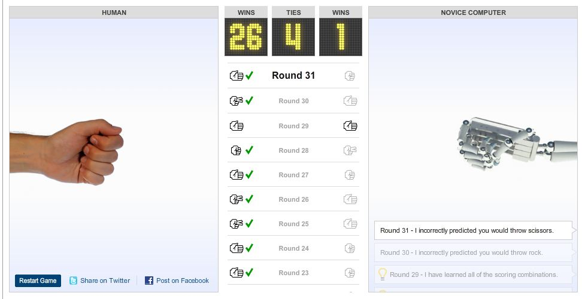

Well interestingly the NY Times have released [a bot that plays Rock, Paper, Scissors](http://www.nytimes.com/interactive/science/rock-paper-scissors.html). As the website states:

> A truly random game of rock-paper-scissors would result in a statistical tie with each player winning, tying and losing one-third of the time. However, people are not truly random and thus can be studied and analysed

But the way the bot works, means the bot can also be studied and analysed...

The way the bot works is quite interesting, it records the order you make your moves in (The first 5 are entirely random in terms of what move the bots will play). It then looks for that pattern of 5 moves in your previous rounds, and then predicts what you will play next. It then plays the appropriate strategy to beat you. If it is unable to find your string of 4 moves, it shortens it down by 1, and looks again. If it is unable to decide, due to that pattern not existing, or it being equal chance between two or more moves, it picks one a random again.

The bot has two modes, Novice and Veteran. Novice, the database of available moves starts from scratch, and the data the bot will analyse is purely based on what you have previously played that session. Veteran is a bit more advanced, and this will draw from over 200,000 previous rounds of experience. This means it’s pretty likely to find a chain similar to yours. However, the real question is how likely you are to follow the patterns set by other people that have also played the game.

In the novice it’s very easy to win, once you understand the algorithm. If you consistently play in an order, for example, if following rock, you always play scissors, then you know the bot will play rock, to beat your scissors. By analysing your own performance and knowing what the bot will through is interesting, and shows you can beat an algorithm.

In the veteran mode it's harder, as you don’t have the dataset to check the results, to beat the algorithm. But I would definitely recommend you have a play with it. There is also a nice walk through mode, where it steps you through the algorithm to help you understand just how its working.

Link is at the top of the article. Have fun.
